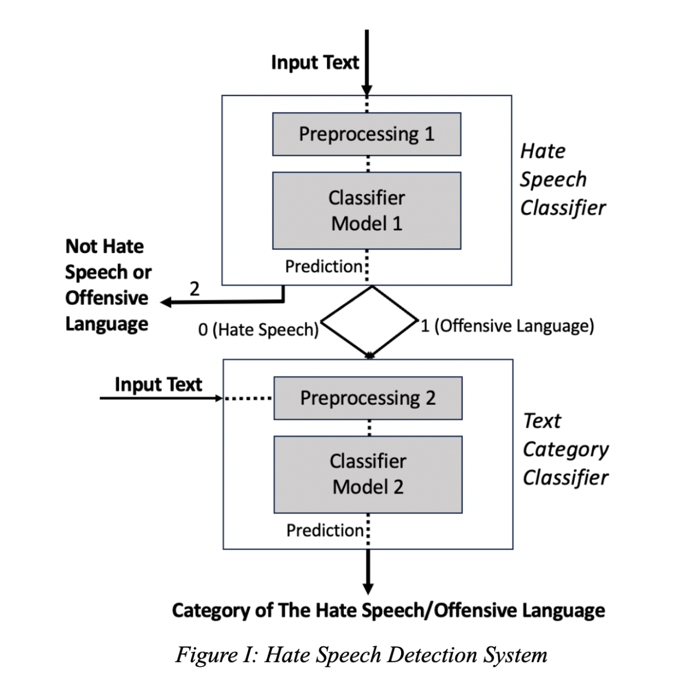

# Hate Speech and Topic Classification System
Lingwen Deng

## Overview
### Context
The internet serves as a platform for free expression but often becomes a space for the spread of hate speech and offensive language. This content has severe societal impacts, including promoting discrimination, harassment, and misinformation. Effective detection and categorization of such content are crucial for fostering safer online environments. This project leverages GenAI concepts and fine-tuned transformer models to tackle the issue of online hate speech and negative language.

### Problem
Online hate speech and offensive language are major challenges, negatively impacting individuals and society. Identifying such harmful content requires robust systems that can effectively handle linguistic nuances and provide deeper insights into the context. Beyond mere detection, having the insights and understanding the thematic categories of this content (e.g., politics, sports, or entertainment) is critical for creating targeted solutions and enhancing online safety.

### Objective
The objective of this project is to develop a robust speech classification that capable of identifying hate speech and/or offensive language within textual data. This system aims to delve deeper by employing topic modeling techniques to categorize such instances into relevant topics (politics, sports, entertainment, etc). This multifaceted approach seeks to not only pinpoint instances of negativity but also to understand the contextual nuances and potential societal implications, thereby contributing to the creation of safer and more informed online space.

### Approach
This project uses a **two-step pipeline**:
**1** **Hate Speech Classifier**: A fine-tuned BERT model detects hate speech, offensive language, or neutral content.
**2** **Topic Classifier**: A second fine-tuned BERT model categorizes hate speech and offensive language into thematic topics for deeper contextual understanding.
This approach ensures both the detection of harmful language and an understanding of its context, enabling more effective solutions for online safety.

## Dataset - Hate Speech Detection Dataset
### Overview
* **Name**: [Hate Speech and Offensive Language Dataset](https://www.kaggle.com/datasets/mrmorj/hate-speech-and-offensive-language-dataset?select=labeled_data.csv)
* **Description**: This dataset contains tweets labeled to classify them into hate speech, offensive language, or neither. It serves as a resource for training and evaluating models designed to detect harmful or inappropriate language in text.
* **Format**: csv
* **Structure**:
	* Columns:
		* id: Unique identifier for each tweet.
		* tweet: Text of the tweet.
		* class: Target variable indicating:
			* 0: Hate Speech
			* 1: Offensive Language
			* 2: Neither
	* Size: 24,783 tweets.
* **Task**: Multi-class classification to detect hate speech and offensive language.

### Preprocessing and Usage
* **Preprocessing Steps**:
	* Cleaned text to remove emojis, URLs, and special characters.
	* Tokenized tweets for compatibility with transformer model BERT.
	* Balanced classes by oversampling underrepresented categories, if necessary.
* **Usage**:
	* Train models to classify tweets into hate speech, offensive language, or neutral categories.
	
### Licensing and Access
* **License**: [CC0: Public Domain](https://creativecommons.org/publicdomain/zero/1.0/) 

## Dataset - Text Category Classification Dataset
### Overview
* **Name**: [News Category Dataset](https://www.kaggle.com/datasets/rmisra/news-category-dataset)
* **Description**: This dataset consists of news headlines and brief descriptions categorized into various topics, including politics, entertainment, sports, and technology. It is designed for text classification tasks to predict the category of a given piece of news.
* **Format**: json
* **Structure**:
	* Columns:
		* category: The target label indicating the news category (e.g., politics, entertainment).
		* headline: The headline of the news article.
		* short_description: A brief description of the article content.
		* link: URL to the full article.
	* Size: 200,853 rows across 41 categories.
* **Task**: Multi-class classification to categorize news headlines into relevant topics.

### Preprocessing and Usage
* **Preprocessing Steps**:
	* Removed null or duplicate rows to ensure data quality.
	* Standardized text by lowercasing and removing unnecessary punctuation.
	* Tokenized and formatted input for BERT-based models.
	* Mapped categories to a consistent set if necessary to reduce granularity (e.g., merging subcategories).
* **Primary Task**:
	* Train models to classify text into thematic categories based on headlines and descriptions.
	
### Licensing and Access
* **License**: [CC0: Public Domain](https://creativecommons.org/publicdomain/zero/1.0/) 

## Model - Hate Speech Classifier
### Overview
* **Model**: [BERT](https://arxiv.org/abs/1810.04805) (Fine-Tuned)
* **Task**: Multi-class text classification to predict whether a given text is:
	* 0: Hate Speech
	* 1: Offensive Language
	* 2: Neutral Content
* **Purpose**: To detect harmful or offensive language and differentiate it from neutral content, forming the first step of the system pipeline.

### Fine-Tuning Details
The model was fine-tuned on the Hate Speech and Offensive Language Dataset, consisting of 24,783 labeled tweets. Here’s the step-by-step process:
* **Preprocessing**
	* Text Cleaning: Removed URLs, emojis, hashtags, mentions, and non-alphanumeric characters to clean the raw text.
	* Tokenization: Used the BERT tokenizer to split text into subwords and added special tokens.
	* Input Formatting: Prepared input features required by BERT:
		* Token IDs: Numerical representation of tokens.
		* Attention Masks: Binary masks indicating padding tokens.
* **Training Setup**:
	* Loss Function: Cross-entropy loss for multi-class classification.
	* Optimizer: AdamW (with weight decay for regularization).
	* Learning Rate Schedule: Used a linear decay scheduler with warm-up steps.
	* Batch Size: 16 (small batches to optimize GPU memory).
	* Epochs: 5 (selected based on validation performance to prevent overfitting).
	* Validation Split: 20% of the training data was set aside for validation.
* **Model Architecture Adjustments**:
	* Added a classification head on top of the BERT model:
		* Fully connected dense layer with softmax activation.
		* Output layer size: 3 (one for each class).
* **Fine-Tuning Environment**:
	* Hardware: NVIDIA Tesla V100 GPU.
	* Frameworks: Hugging Face [Transformers](https://huggingface.co/docs/transformers/index) and [PyTorch](https://pytorch.org/).

### Performance
* **Overall Performance**
Accuracy: 91%
Macro Avg F1-Score: 0.76
Weighted Avg F1-Score: 0.90
Matthews Correlation Coefficient (MCC): 0.748
* **Class 0 (Hate Speech)**:
	* Precision: 0.50
	* Recall: 0.38
	* F1-Score: 0.43
	* Support: 155 samples
* **Class 1 (Offensive Language)**:
	* Precision: 0.93
	* Recall: 0.95
	* F1-Score: 0.94
	* Support: 1,893 samples
* **Class 2 (Neutral)**:
	* Precision: 0.90
	* Recall: 0.89
	* F1-Score: 0.90
	* Support: 430 samples

### Usage
* **Input**: A cleaned tweet or sentence.
	* Example: “I can’t stand people like you.”
* **Output**: Predicted class (1: Offensive Language).

## Model - Text Category Classifier
### Model Description
* **Model**: [BERT](https://arxiv.org/abs/1810.04805)(Fine-Tuned)
* **Task**: Multi-class text classification to assign a topic label (e.g., politics, sports, entertainment) to input text.
* **Purpose**: To provide thematic categorization of hate speech or offensive language, enabling deeper contextual analysis and targeted interventions.

### Fine-Tuning Details
The model was fine-tuned on the News Category Dataset , containing over 200,000 news headlines and short descriptions categorized into 10 topics. Here’s the fine-tuning process:
* **Preprocessing**:
	* Text Cleaning: Removed punctuation, special characters, and standardized casing.
	* Tokenization: Utilized the BERT tokenizer to split text into subwords and added tokens.
	* Input Formatting: Created input features for BERT:
		* Token IDs for text.
		* Attention masks to identify padding tokens.
* **Training Setup**:
	* Loss Function: Cross-entropy loss for multi-class classification.
	* Optimizer: AdamW with weight decay for regularization.
	* Learning Rate Schedule: Linear decay scheduler with warm-up steps.
	* Batch Size: 16.
	* Epochs: 5
	* Validation Split: 15% of the training data was used for 
validation.
* **Model Architecture Adjustments**:
	* Added a classification head to BERT:
		* Fully connected dense layer with a softmax activation function.
		* Output size: 10 (number of categories).
* **Fine-Tuning Environment**:
	* Hardware: NVIDIA Tesla V100 GPU.
	* Frameworks: [Hugging Face Transformers](√) and [PyTorch](https://pytorch.org/).

### Performance
* **Overall Performance**
Accuracy: 86%
Macro Avg Precision: 0.83
Macro Avg Recall: 0.82
Macro Avg F1-Score: 0.82
Weighted Avg F1-Score: 0.86
* **Class-wise Metrics**:
	* Business
	Precision: 0.77, Recall: 0.70, F1-Score: 0.74, Support: 1,528
	* Comedy
	Precision: 0.72, Recall: 0.49, F1-Score: 0.58, Support: 1,067
	* Entertainment:
	Precision: 0.84, Recall: 0.84, F1-Score: 0.84, Support: 3,502
	* Food & Drink:
	Precision: 0.87, Recall: 0.88, F1-Score: 0.88, Support: 1,685
	* Parenting:
	Precision: 0.78, Recall: 0.89, F1-Score: 0.83, Support: 2,566
	* Politics:
	Precision: 0.91, Recall: 0.93, F1-Score: 0.92, Support: 7,174
	* Sports:
	Precision: 0.77, Recall: 0.89, F1-Score: 0.83, Support: 1,015
	* Style & Beauty:
	Precision: 0.88, Recall: 0.88, F1-Score: 0.88, Support: 2,424
	* Travel:
	Precision: 0.88, Recall: 0.91, F1-Score: 0.89, Support: 1,920
	* Wellness:
	Precision: 0.89, Recall: 0.83, F1-Score: 0.86, Support: 4,915

* **Confusion Matrix Insights**:
	* Categories like Politics (Precision: 0.91, Recall: 0.93) and Food & Drink (Precision: 0.87, Recall: 0.88) show strong performance, indicating accurate predictions for these classes.
	* Categories such as Comedy (Precision: 0.72, Recall: 0.49) show lower recall, suggesting challenges in correctly identifying all instances of comedy content.
	* Misclassifications primarily occur in semantically overlapping categories, such as “Entertainment” vs. “Comedy” or “Wellness” vs. “Parenting.”

### Usage
* **Input**: A cleaned text string detected as hate speech or offensive language.
	* Example:  “The politician’s recent actions have sparked controversy.”
* **Output**: Predicted category: Politics
.

## Model Pipeline: Hate Speech and Topic Classification System
### Overview
The model pipeline integrates two fine-tuned BERT models to analyze textual data in a sequential manner. This pipeline allows the system to detect harmful or offensive language and categorize it into relevant topics, providing both detection and context.

### Pipeline Structure
* **Step 1: Hate Speech Classifier**
	* Function: Determines whether the input text contains hate speech, offensive language, or is neutral.
	* Output:
		* 0: Hate Speech
		* 1: Offensive Language
		* 2: Neutral (not offensive or hate speech)
	* Next Step: Only texts classified as hate speech or offensive language (0 or 1) proceed to the next stage.
* **Step 2: Topic Classifier**
	* Function: Assigns a thematic category to the input text if it is identified as hate speech or offensive language.
	* Output: One of 10 predefined topics, such as Politics, Entertainment, Sports, etc.

### Workflow
* **Input**: The pipeline receives raw text (e.g., tweets or comments).
* **Preprocessing**:
	* Clean the text (remove URLs, emojis, special characters, etc.).
	* Tokenize and prepare input for BERT models.
* **Hate Speech Classification**:
	* The first model predicts whether the input is neutral, offensive, or hate speech.
* **Conditional Flow**:
	* If classified as neutral, the pipeline stops.
	* If classified as hate speech or offensive language, the text is passed to the Topic Classifier.
* **Topic Classification**:
	* The second model predicts the topic category of the harmful content.
* **Output**:
	* Combined results showing the nature of the text (neutral, offensive, or hate speech) and, if applicable, the topic category.

### Example Use Case
* **Input:**
Text: “This politician is a disgrace and a terrible example of leadership!”
* **Process:**
1. Hate Speech Classifier:
Output: Offensive Language (1)
2. Topic Classifier:
Output: Politics (Politics)
* **Final Output:**
	* Classification: Offensive Language
	* Topic: Politics

## Critical Analysis - Impact of the Project 
* **Content Moderation**:
	* Enables automated detection of hate speech and offensive language, helping online platforms flag or remove harmful content efficiently.
	* Reduces reliance on manual moderation, which can be time-intensive and psychologically taxing.
* **Contextual Insights**:
	* By categorizing offensive content into topics (e.g., politics, sports, or entertainment), the system provides actionable insights into the thematic trends of harmful language.
	* This can aid policymakers, researchers, and platform administrators in targeting specific areas of concern.
* **Safer Online Spaces**:
	* Contributes to creating a safer and more inclusive internet by identifying and categorizing harmful language.
	* Offers potential for broader applications, such as trend analysis, public opinion monitoring, and informing educational campaigns against hate speech.

## Critical Analysis - Next Steps
* **Enhance Dataset Diversity**:
	* Collect and include data from more diverse sources and languages to improve model robustness and fairness.
	* Augment datasets with more samples for underrepresented classes, especially hate speech.
* **Advanced Contextual Models**:
	* Explore larger and more advanced transformer models (e.g., GPT-4 or T5) for better handling of nuanced language.
	* Introduce fine-tuning techniques like adversarial training to improve performance on ambiguous or rare examples.
* **Expand Applications**:
	* Extend the system to support multiple languages for a broader global impact.
	* Explore additional tasks, such as sentiment analysis, to complement topic categorization.

## Bibliography
1. Jacob Devlin, Ming-Wei Chang, Kenton Lee, Kristina Toutanova
BERT: Pre-training of Deep Bidirectional Transformers for Language Understanding.
arXiv preprint arXiv:1810.04805, 2018.
URL: https://arxiv.org/abs/1810.04805
2. Thomas Wolf, Lysandre Debut, Victor Sanh, Julien Chaumond, Clement Delangue, Anthony Moi, Pierric Cistac, et al.
Transformers: State-of-the-art Natural Language Processing.
Proceedings of the 2020 Conference on Empirical Methods in Natural Language Processing: System Demonstrations, 38–45, 2020.
URL: https://github.com/huggingface/transformers
3. Zeerak Waseem, Dirk Hovy
Hateful Symbols or Hateful People? Predictive Features for Hate Speech Detection on Twitter.
Proceedings of the NAACL Student Research Workshop, 88–93, 2016.
URL: https://aclanthology.org/N16-2013.pdf
4. Anna Schmidt, Michael Wiegand
A Survey on Hate Speech Detection using Natural Language Processing.
Proceedings of the Fifth International Workshop on Natural Language Processing for Social Media, 1–10, 2017.
URL: https://aclanthology.org/W17-1101.pdf
5. Derek Doran, Shanshan Wu, Sanda Harabagiu
Automated Hate Speech Detection and the Problem of Offensive Language.
Proceedings of the European Chapter of the Association for Computational Linguistics (EACL), 85–92, 2013.
URL: https://aclanthology.org/E13-1010.pdf

